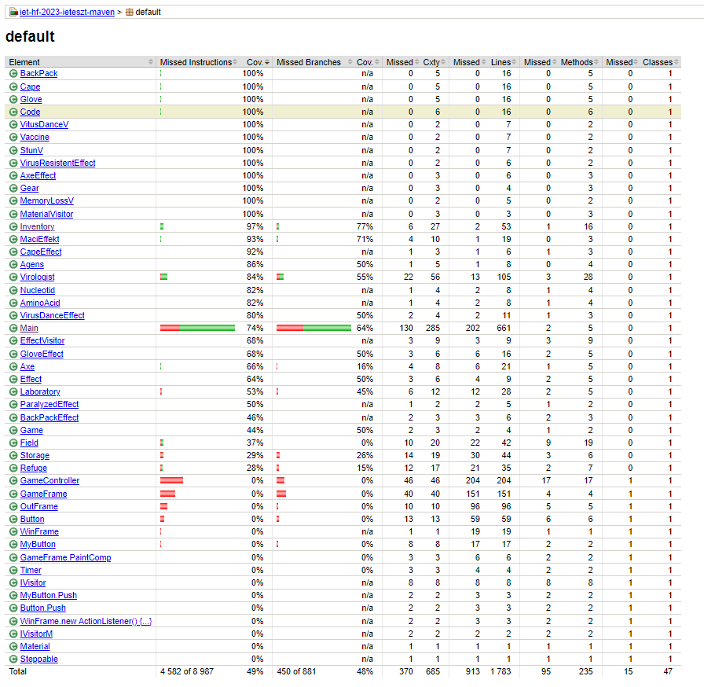

Végezte Lenkovics Ákos
## JaCoCo bekötése
pom.xml-en belül
A dependencies tagen belülre:
<dependency>
  <groupId>org.jacoco</groupId>
  <artifactId>jacoco-maven-plugin</artifactId>
  <version>0.8.7</version>
  <scope>test</scope>
</dependency>
A build/plugins tagen belülre:
<plugin>
    <groupId>org.jacoco</groupId>
    <artifactId>jacoco-maven-plugin</artifactId>
    <version>0.8.7</version>
    <executions>
        <execution>
            <id>default-prepare-agent</id>
            <goals>
                <goal>prepare-agent</goal>
            </goals>
        </execution>
        <execution>
            <id>default-report</id>
            <phase>prepare-package</phase>
            <goals>
                <goal>report</goal>
            </goals>
        </execution>
    </executions>
</plugin>

//mint a hatodik gyakorlaton

## Code coverage 
```
mvn verify
```
Futtatása után a target/site/jacoco/site/index.html-ben megtalálható a jelentés.
