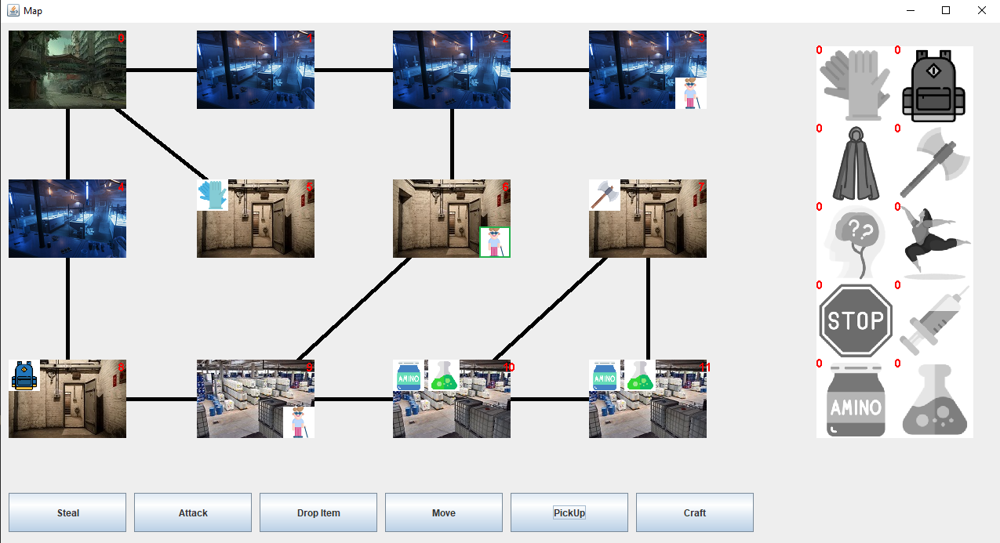
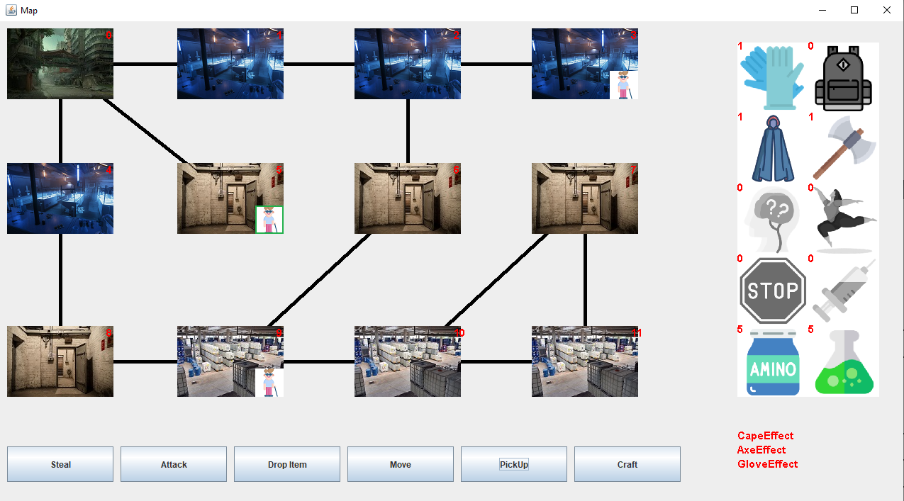
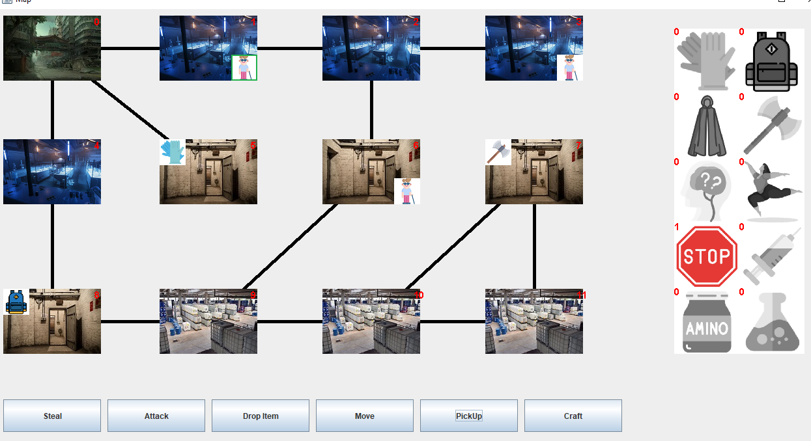
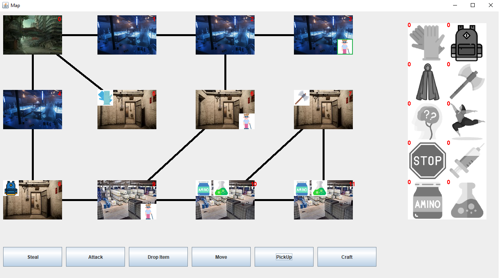

# Manuális tesztek megtervezése, végrehajtása és dokumentálása
Végezte: Lenkovics Ákos, CDGJW9

## Use-case neve Drop
### Leírás: A virológus a birtokolt felszerelésből eldob
### Forgatókönyv:
 - A virológus kiválaszt egy felszerelést amit el akar dobni.
 - A virológus eldobja a felszerelést.
 - A felszerelés eltűnik a játékból.
### Alternatív forgatókönyv:
 - A virológus nem tudja eldobni a zsákját, mivel tele van

### Terv
A sorban másodikként következő virológus felveszi a köpenyt, majd a következő körében eldobja
### Végrehajtás
PickUp //< első virológus körét pazaroljuk
PickUp //< második Virológus felveszi a köpenyt
PickUp //< harmadik virológus körét pazaroljuk
PickUp //< első virológus körét pazaroljuk
Drop Item
-> Gear1
PickUp //< harmadik virológus körét pazaroljuk
PickUp //< első virológus körét pazaroljuk
Ezen a ponton ellenőrizhetjük, ha nincs a 6-os mezőn felszerelés, és a virológus hátizsákja is üres, akkor sikeres a teszt!

### Terv
A sorban másodikként következő virológus felveszi a köpenyt, a hátizsákot, az aminosavakat és nukleotidokat, a fejszét, majd a kesztyűt.
Ha ezeket felvette, eldobja a hátizsákot.
### Végrehajtás
A második virológus útvonala: 6,9,8,9,10,11,7,10,9,8,4,0,5.
1-PickUp //< első virológus körét pazaroljuk
2-PickUp //< második Virológus felveszi a köpenyt
3-Move->6 //< harmadik virológus körét pazaroljuk
1-PickUp //< V1 NOP
2-Move->9 //< második Virológus mozog
3-PickUp //< V3 NOP
1-PickUp //< V1 NOP
2-PickUp //< második Virológus felveszi az aminosavat és nukleotidot
3-PickUp //< V3 NOP
1-PickUp //< V1 NOP
2-Move->8 //< második Virológus mozog
3-PickUp //< V3 NOP
1-PickUp //< V1 NOP
2-PickUp //< második Virológus felveszi a TÁSKÁT
3-PickUp //< V3 NOP
1-PickUp //< V1 NOP
2-Move->9 //< második Virológus mozog
3-PickUp //< V3 NOP
1-PickUp //< V1 NOP
2-Move->10 //< második Virológus mozog
3-PickUp //< V3 NOP
1-PickUp //< V1 NOP
2-PickUp //< második Virológus felveszi a N és A
3-PickUp //< V3 NOP
1-PickUp //< V1 NOP
2-Move->11 //< második Virológus mozog
3-PickUp //< V3 NOP
1-PickUp //< V1 NOP
2-PickUp //< második Virológus felveszi a N és A
3-PickUp //< V3 NOP
1-PickUp //< első virológus körét pazaroljuk
2-Move->7 //< második Virológus mozog
3-PickUp //< V3 NOP
1-PickUp //< V1 NOP
2-PickUp //< második Virológus felveszi a fejszét
3-PickUp //< V3 NOP
1-PickUp //< V1 NOP
2-Move->10 //< második Virológus mozog
3-PickUp //< V3 NOP
1-PickUp //< V1 NOP
2-Move->9 //< második Virológus mozog
3-PickUp //< V3 NOP
1-PickUp //< V1 NOP
2-Move->8 //< második Virológus mozog
3-PickUp //< V3 NOP
1-PickUp //< V1 NOP
2-Move->4 //< második Virológus mozog
3-PickUp //< V3 NOP
1-PickUp //< V1 NOP
2-Move->0 //< második Virológus mozog
3-PickUp //< V3 NOP
1-PickUp //< V1 NOP
2-Move->5 //< második Virológus mozog
3-PickUp //< V3 NOP
1-PickUp //< V1 NOP
2-PickUp //< második Virológus felveszi a kesztyűt
3-PickUp //< V3 NOP
1-PickUp //< V1 NOP
2-Drop Item -> Gear2 //< Második virológus eldobja a táskáját
PickUp //< harmadik virológus körét pazaroljuk
PickUp //< első virológus körét pazaroljuk
Ezen a ponton ellenőrizhetjük, hogy van-e táskája a virológusnak, és nincs, tehát el tudta dobni, pedig tele volt.

## Use-Case neve Make
### Leírás: A virológus a birtokolt anyagaiból és a megtanult genetikai kódból létrehoz egy ágenst.
### Forgatókönyv:
 - A virológus kiválaszt egy genetikai kódot, amiből létrehoz akar hozni egy ágenst.
 - A virológus létrehozza az ágenst.
 - A virológus által birtokolt anyag csökken.
### Alternatív Forgatókönyv:
 - A virológus az ágnest nem tudja létrehozni, mert nem rendelkezik elég anyaggal.
 - Az ágens létrehozása sikertelen.
### Terv
Harmadik virológus felveszi a mellette lévő anyagokat, majd elmegy a 2-es laborba ahol elkészít egy ágenst.
### Végrehajtás
Megjegyzés: A teszt elbukik, ha az első virológus laborján indul a Maci vírus
1-PickUp
2-PickUp
3-PickUp
1-PickUp
2-PickUp
3-Move->10
1-PickUp
2-PickUp
3-PickUp
1-PickUp
2-PickUp
3-Move->11
1-PickUp
2-PickUp
3-PickUp
1-PickUp
2-PickUp
3-Move->10
1-PickUp
2-PickUp
3-Move->9
1-PickUp
2-PickUp
3-Move->8
1-PickUp
2-PickUp
3-Move->4
1-PickUp
2-PickUp
3-Move->0
1-PickUp
2-PickUp
3-Move->1
1-PickUp
2-PickUp
3-PickUp
1-PickUp
2-PickUp
3-Craft->CodeCode@90d26a3 //< Látható, hogy a virológus ágensei között a legyártott bénító ágens

### Terv
Első virológus laboron indul, az itteni kódot felvesz, majd a következő körében megpróbálja elkészíteni az ágenst, de nem sikerül.
### Végrehajtás
1-PickUp
2-PickUp
3-PickUp
1-Craft->CodeCode@114b0fc // nem tud craftolni semmit, mert nincs elég anyaga
2-PickUp
3-PickUp
1- //< Ellenőrízhető, hogy a virológusnak nincs legyártott ágense.

## Use-case neve Move
### Leírás
 A virológus mozgatása a pályán
### Forgatókönyv:
 - virológus kiválaszt egy szomszédos mezőt, hogy rálépjen
 - A virológus odalép.
### Terv
Az első virológussal a szomszédos mezőre átlépünk az első körben
### Végrehajtás
1-Move->2
Ezen a ponton a virológus ikonja a szomszédos mezőn kell legyen.
Ha a virológus odébb lépett, akkor sikeres a teszt.
!()[MoveUseCase.png]
!()[MoveUseCaseResult.png]

# Tapasztalat
A tesztelést megnehezítette, hogy a pálya a kódba van drótozva és csak a játék játszásával lehet határeseteket vizsgálni.
Minden teszteset több use-case kénytelen tesztelni, például a Drop User-case teszteli a Take use-case-t is.