# Nem funkcionális jellemzők vizsgálata
Készítette:Kopácsi Károly(ZLIYY4), Imets Ákos(D7H8G6)

## Terhelés teszt
A mért értékek vizsgálatát a GPU-Z és a CORE Temp programmal vizsgáltuk.

### Futtatás előtt:

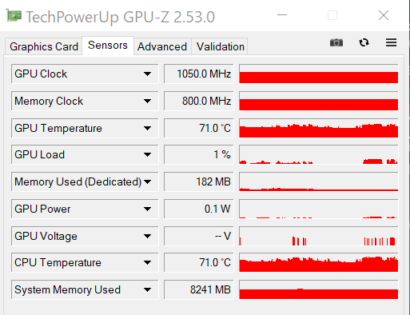

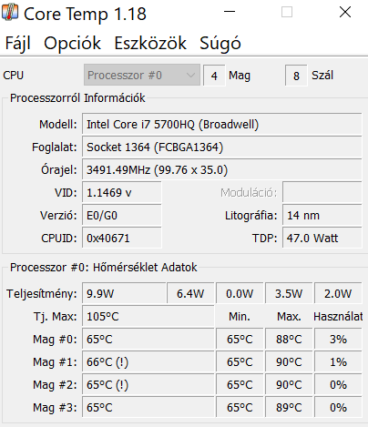

### Futtatás után:

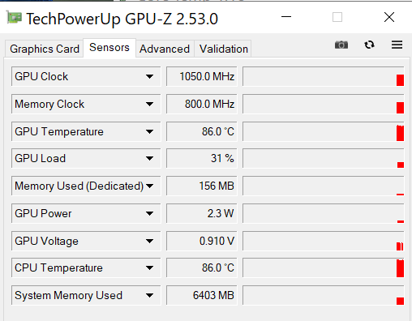

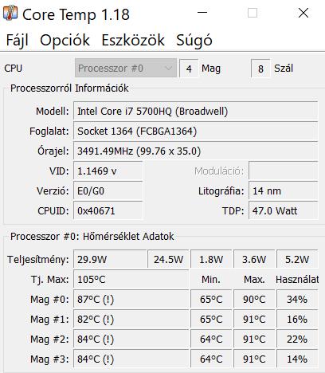

A GPU terhelése független a programunk futásától. A CPU magok átlagosan 20 százalékos plussz terhelést kaptak a program futtatásától.

## Használhatósági teszt 

Manuálisan végeztük el a tesztet.

### Az alábbi teszteket végeztük el:

-  A narrátor nem ismerte fel az ablakon lévő elemeket csak azt, hogy a map ablakon vagyunk, illetve azt ha új ablakot nyitottunk.
- Az operációs rendszerben a feliratok 150%-ra növelése nem változtatott az alkalmazás szövegén. 
- A kontraszt átállítását érzékelte és az alapján át is állítódott:

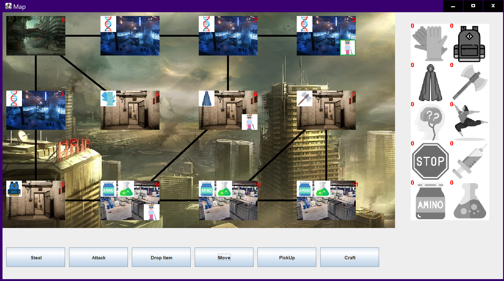

- A move ablakban nagyon kicsik a gombok nehéz olvasni őket, az ablak kitakarja a játék pályát, ezzel is megnehezítve a játékos dolgát:
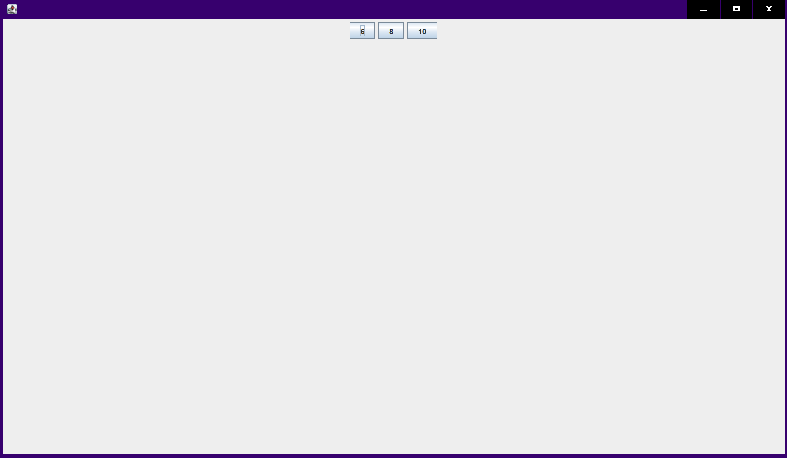

- A craft kód gombjainak felirata bonyolult és csúnya, illetve nem ad figyelmeztetést, ha nem sikerült a craftolás:
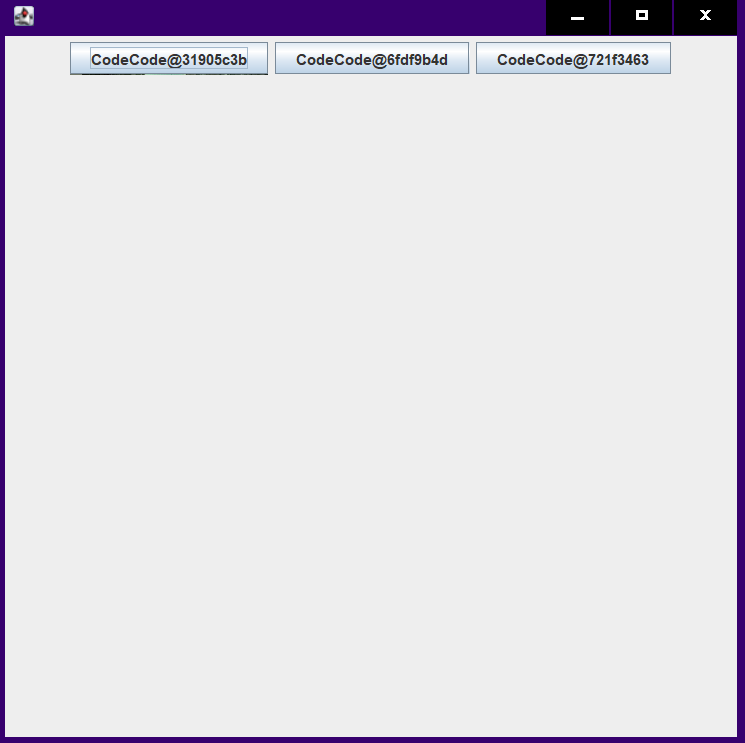

- A színszűrők használatára jól reagált az alkalmazás:
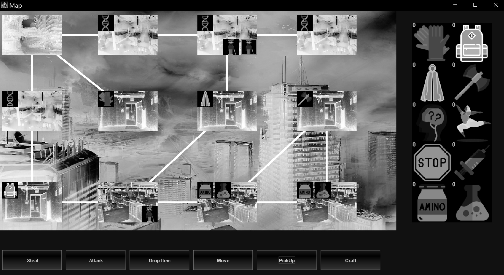
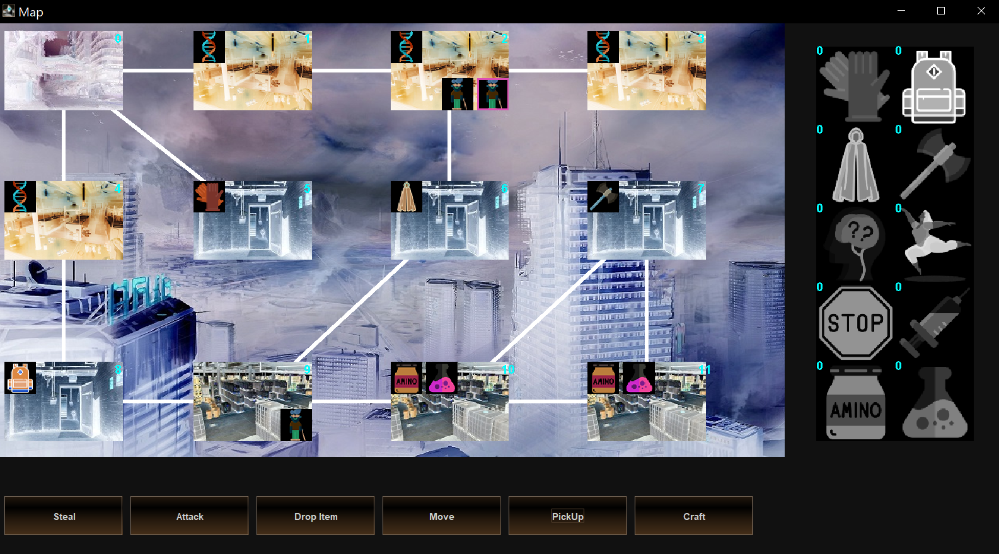

- A map ablak átméretezésével a rajta lévő elemeket el lehet tűntetni(pl: alsó gombok).
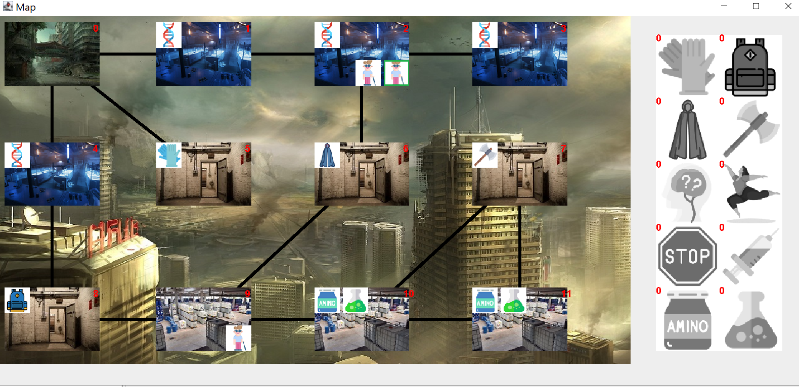

- A játék végét jelző ablak felirata nem látható:
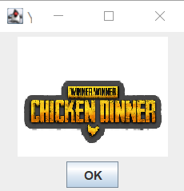

## Összegzésként

Az alkalmazás csak pár kisegítő opcióra reagál, a felhasználónak tudnia kell, hogy mit csinál, mert a felület és a végcél nem egyértelmű. A navigáció viszont egyszerű és átlátható, csak picit zavaró, hogy kitakarja a mappot. A nálunk lévő dolgokat viszont egyértelműen és átláthatóan jelzi.

