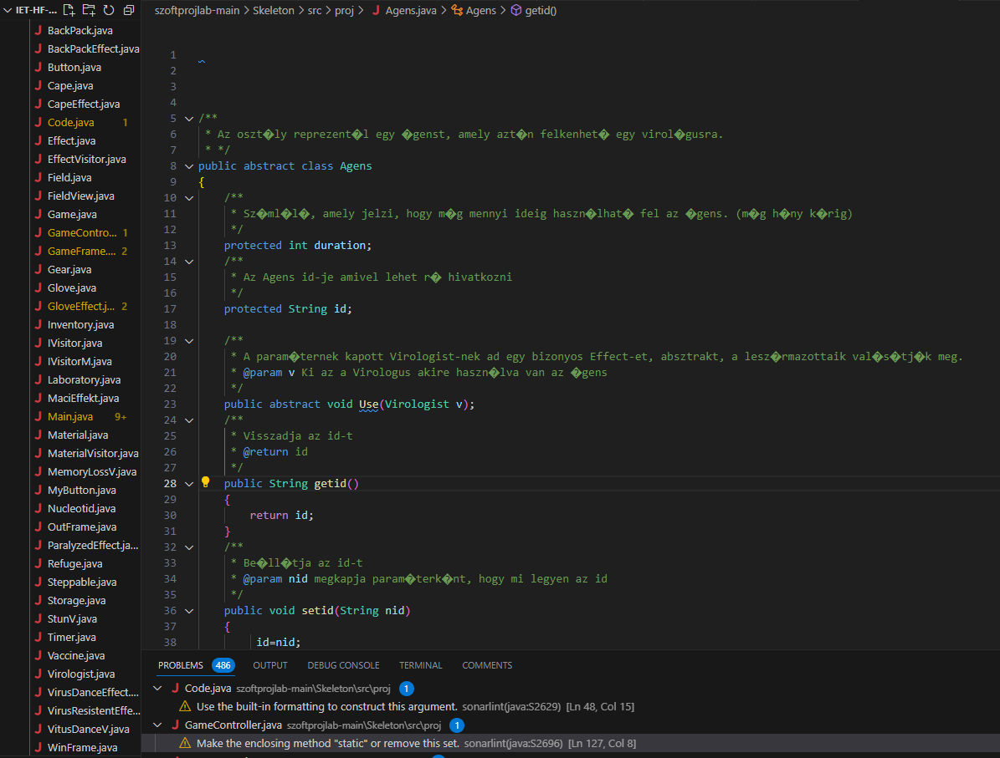
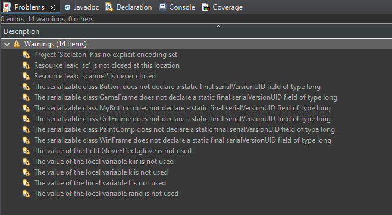

# Manuális kódtesztelés
Készítette:Kopácsi Károly(ZLIYY4), Imets Ákos(D7H8G6)

Spotbugs és SonarLint használatával.

Javítás előtt:

## AxeEffect.java, BackPackEffect.java: 
*Add a nested comment explaining why this method is empty, throw an UnsupportedOperationException or complete the implementation.*

**javítás:** Metóduson belüli komment.

## Button.java: 
*Make "obj" transient or serializable.*

**javítás:**

	 private transient Object obj;

## Code.java: 
*Replace this use of System.out or System.err by a logger.*

**javítás:** 

	private static final Logger logger = Logger.getLogger(Code.class.getName());
	logger.info("\tgetAgens() Agens gettere lefut");
       
## Field.java: 
`Random rand = new Random();` : Save and re-use this "Random".

 `public void setid(String nid)`: Rename method "setid" to prevent any misunderstanding/clash with method "setId".
 
## Game.java: 
*Add a private constructor to hide the implicit public one.*

**javítás:**
 
 	private Game() {
        // Privát konstruktor
    }

## GameController.java: 

*Rename "x" which hides the field declared at line 14.*

**javítás:** `int x=1040` => `x=1040`

*Remove this useless assignment to local variable "o".*

**javítás:** `OutFrame o = new OutFrame(agens, 3, 0, this);` => `new OutFrame(agens, 3, 0, this);`

*Unused assignments should be removed*
	WinFrame wf= new WinFrame();

**javítás:**

	new WinFrame();

*Remove this useless assignment to local variable "o".*
	
	OutFrame o = new OutFrame(geras, 1, 0, this);

**javítás:**

	new OutFrame(geras, 1, 0, this); 

## GameFrame.java

Fölösleges importok törlése, osztály szintű nem használt váétozók törlése.
  
## Main.java: 
*Remove this object instantiation and use "Laboratory.class" instead.*

`fields.get(i).getClass() == new Laboratory.getClass()` => `fields.get(i) instanceof Laboratory`

*Remove this object instantiation and use "StunV.class" instead.*

	if (virologists.get(i).getinventory().GetAgens().get(j).getClass().equals(new StunV().getClass())) {
		statsall += ("StunV]");
		}

**javítás:**

	if (virologists.get(i).getinventory().GetAgens().get(j) instanceof StunV) {
		statsall += ("StunV]");
	}

## Refuge.java
	gear.getClass()==new BackPack().getClass()

*Remove this object instantiation and use "Glove.class" instead.*

**javítás:**

	gear instanceof BackPack

## WinFrame.java

	ok.addActionListener( new ActionListener() {
		@Override
		public void actionPerformed(ActionEvent e) {
			System.exit(0);	
		}	
	});

*Make this anonymous inner class a lambda (sonar.java.source not set. Assuming 8 or greater.)*

**javítás:**
	
	
	ok.addActionListener(e -> System.exit(0));

# Javítások eredménye:

