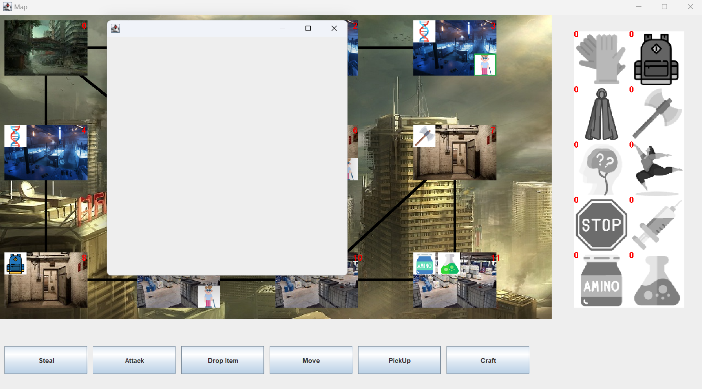
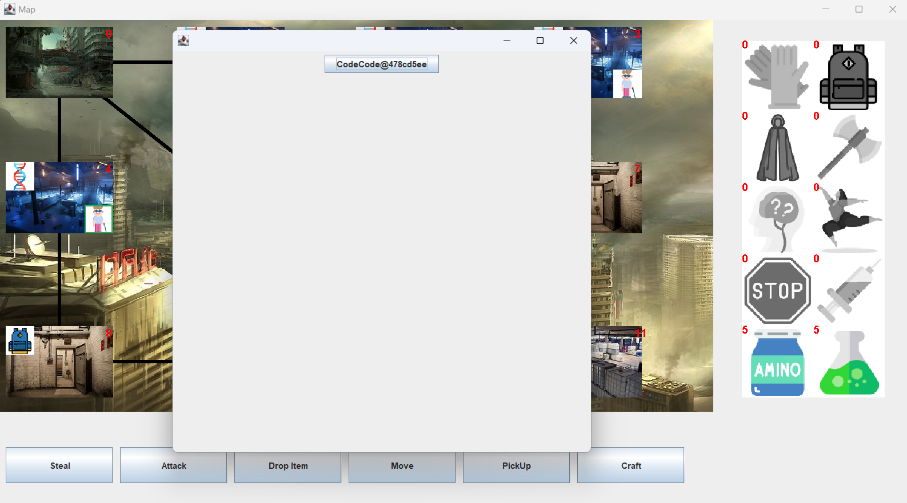
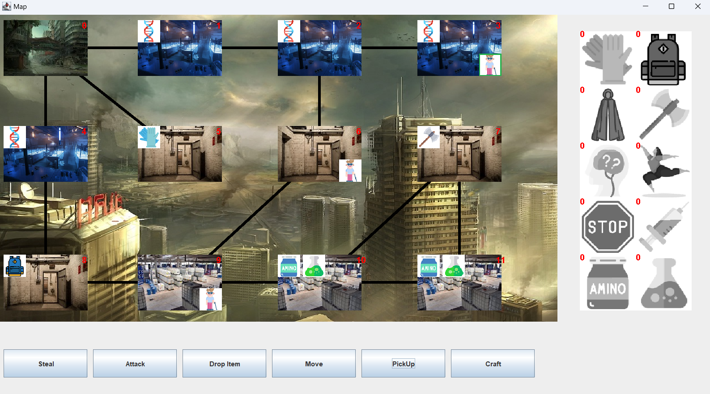

# Manuális tesztek

## Teszt 1: Letapogatás
**Use-case neve**: Touch  
**Rövid leírás**: A virológus letapogatja a falat és megtanulja a kódot 
amennyiben nem rendelkezik vele,továbbá a játék véget ér 
amennyiben a virológus az utolsó szükséges kódot tanulta 
meg. Ha medve vírusa van a virológusnak nem tanul meg 
semmit.  
**Aktorok**: Player  
**Forgatókönyv**:  
1.A virológusnak nincsen medve vírusa. 
2.A virológus megtanulja a kódot.  
3.A játék nem ér véget.  
**Alternatív forgatókönyv 1**:  
1.A virológusnak nincsen medve vírusa. 
2.A virológus már ismeri a kódot,nem történik semmi.  
**Alternatív forgatókönyv 2**:  
1.A virológusnak nincsen medve vírusa. 
2.A virológus megtanulja a kódot  
3.A játék véget ér.  
**Alternatív forgatókönyv 3**:  
1.A virológusnak medve vírusa van.
2.A virológus nem tanul meg semmit sem.  

### **Terv 1 (Forgatókönyv)**: A sorban első virológus megtanul egy olyan kódot, amelyet még nem ismer. Csak egy kódot tanul, meg így a játék folytatódik.

### Végrehajtás:
- V1 Craft  // ekkor még nem jelenik meg semmilyen ágens, hiszen a virológus még nem ismer egy kódot sem, üres a lista

- V2 PickUp  // továbbadjuk a kört
- V3 PickUp  // továbbadjuk a kört
- V1 PickUp  // letapogatjuk a falat, megtanuljuk a kódot
- V2 PickUp  // továbbadjuk a kört
- V3 PickUp  // továbbadjuk a kört
- V1 Craft  // Ekkor már megjelenik a megtanult kód a listában. Ha lenne anyagunk, akár le is craftolhatnánk.

### **Terv 2 (Alternatív forgatókönyv 1)**: A sorban első virológus megtanul egy olyan kódot, amelyet már ismer.

### Végrehajtás:
- V1 Craft  // üres lista, nem ismer egy kódot sem
- V2 PickUp  // továbbadjuk a kört
- V3 PickUp  // továbbadjuk a kört
- V1 PickUp  // letapogatjuk a falat, megtanuljuk a kódot
- V2 PickUp  // továbbadjuk a kört
- V3 PickUp  // továbbadjuk a kört
- V1 Craft  // megjelenik a megtanult kód a listában
- V1 PickUp  // letapogatjuk a falat, megpróbáljuk ismét megtanulni a kódot
- V2 PickUp  // továbbadjuk a kört
- V3 PickUp  // továbbadjuk a kört
- V1 Craft  // nem tanultuk meg ismételten a kódot, továbbra is egy elemű a lista

### **Terv 3 (Alternatív forgatókönyv 2)**: A sorban első virológus megtanulja az összes kódot, a játék véget ér.
- **3-as mező:**
- V1 PickUp  // Megtanulunk egy kódot
- V2 PickUp  // továbbadjuk a kört
- V3 PickUp  // továbbadjuk a kört
- V1 Move 2  // átlépünk a 2-es mezőre
- V2 PickUp  // továbbadjuk a kört
- V3 PickUp  // továbbadjuk a kört
- **2-es mező:**
- V1 PickUp  // Megtanulunk egy kódot
- V2 PickUp  // továbbadjuk a kört
- V3 PickUp  // továbbadjuk a kört
- V1 Move 1  // átlépünk az 1-es mezőre
- V2 PickUp  // továbbadjuk a kört
- V3 PickUp  // továbbadjuk a kört
- **1-es mező:**
- V1 PickUp  // Megtanulunk egy kódot
- V2 PickUp  // továbbadjuk a kört
- V3 PickUp  // továbbadjuk a kört
- V1 Move 0  // átlépünk az 0-ás mezőre
- V2 PickUp  // továbbadjuk a kört
- V3 PickUp  // továbbadjuk a kört
- **0-ás mező:**
- V1 Move 4  // átlépünk az 4-es mezőre
- V2 PickUp  // továbbadjuk a kört
- V3 PickUp  // továbbadjuk a kört
- **4-es mező:**
- V1 Craft  // meggyőződünk róla, hogy tényleg 3 kódot tanultunk meg eddig

- V1 PickUp  // megismerük az összes kódot, megnyertük a játékot

# Teszt 2: Craft
**Use-case neve**: Craft  
**Rövid le9írás**: A virológus létrehozza a kiválasztott ágenst a kódnak 
megfelelően.  
**Aktorok** Player 
**Forgatókönyv**: 
1.A virológus megkapja a kód szerint kiválasztott ágenst.  
2.A virológus elveszti a felhasznált nyersanyagokat.  
**Alternatív forgatókönyv** 
1.Nincsen elég nyersanyag,nem történik semmi

### **Terv 1 (Forgatókönyv)**: A sorban harmadik virológus összegyűjti a megfelelő mennyiségű anyagot és lecraftol egy ágenst.

### Végrehajtás:
- V1 PickUp // továbbadjuk a kört
- V2 PickUp // továbbadjuk a kört
- V3 PickUp // felvesszük a mezőn található anyagokat

- V1 PickUp // továbbadjuk a kört
- V2 PickUp // továbbadjuk a kört
- V3 Move 10 // átlépünk a 10-es mezőre

- V1 PickUp // továbbadjuk a kört
- V2 PickUp // továbbadjuk a kört
- V3 PickUp // felvesszük a mezőn található anyagokat

- V1 PickUp // továbbadjuk a kört
- V2 PickUp // továbbadjuk a kört
- V3 Move 11 // átlépünk a 11-es mezőre

- V1 PickUp // továbbadjuk a kört
- V2 PickUp // továbbadjuk a kört
- V3 PickUp // felvesszük a mezőn található anyagokat

- V1 PickUp // továbbadjuk a kört
- V2 PickUp // továbbadjuk a kört
- V3 Move 10 // átlépünk a 10-es mezőre

- V1 PickUp // továbbadjuk a kört
- V2 PickUp // továbbadjuk a kört
- V3 Move 9 // átlépünk a 9-es mezőre

- V1 PickUp // továbbadjuk a kört
- V2 PickUp // továbbadjuk a kört
- V3 Move 8 // átlépünk a 8-as mezőre

- V1 PickUp // továbbadjuk a kört
- V2 PickUp // továbbadjuk a kört
- V3 Move 4 // átlépünk a 4-es mezőre

- V1 PickUp // továbbadjuk a kört
- V2 PickUp // továbbadjuk a kört
- V3 PickUp  // megtanuljuk a kódot

- V1 PickUp // továbbadjuk a kört
- V2 PickUp // továbbadjuk a kört
- V3 Craft  // lecraftoljuk a megtanult kódból az ágenst, az anyagok felhasználásával

### **Terv 2 (Alternatív forgatókönyv 1)**: A sorban első virológus nem gyűjti össze a megfelelő mennyiségű anyagot és megpróbál lecraftolni egy ágenst (nem sikerül neki).

### Végrehajtás:
- V1 PickUp // megtanuljuk a kódot
- V2 PickUp // továbbadjuk a kört
- V3 PickUp // továbbadjuk a kört
- V1 Craft // megpróbálunk craftolni, nem sikerül

- V2 PickUp // továbbadjuk a kört
- V3 PickUp // továbbadjuk a kört
