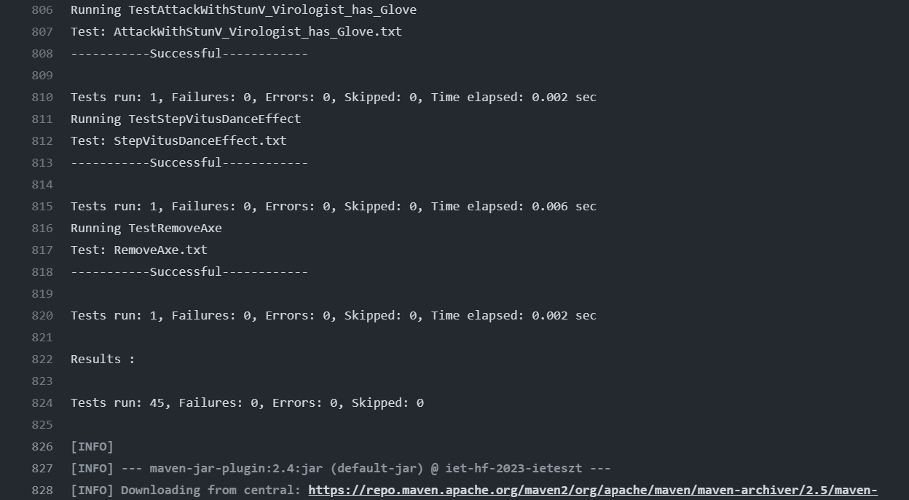

Végezte: Balázs Martin, Lenkovics Ákos

## GitHub Actions felállítása
A GitHubon a projekt Actions oldalán a Java with Maven gomb megnyomásával a GitHub generálta a maven.yml fájlt.
Ezzel a CI része készen van.

## Maven felállítása a projektben
Mivel a projekt nem java konvenció szerint volt eredetileg felépítve, ezért a következőkkel kellett kiegészíteni a build részt.

```
<sourceDirectory>szoftprojlab-main/Skeleton/src</sourceDirectory>
<testSourceDirectory>szoftprojlab-main/Skeleton/test</testSourceDirectory>
```
és a következő függőséggel kellett kiegészíteni, hogy a unit teszteket is tudja futtatni.
```
    <dependency>
      <groupId>junit</groupId>
      <artifactId>junit</artifactId>
      <version>4.11</version>
      <scope>test</scope>
    </dependency>
```
Mivel a forráskód kommentjében vannak ékezetes karakterek a karakterkódolást Cp1250-re állítottuk.
```
<project.build.sourceEncoding>Cp1250</project.build.sourceEncoding>
```

### Mindezekután a teszteket futtatja a github actions, miután buildelte a projektet.
